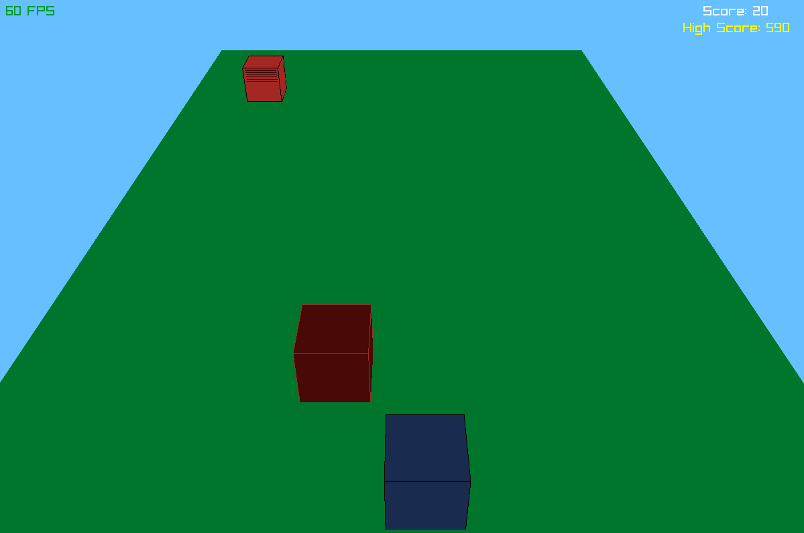

# Cube Runner
> A Simple runner game, built with **C++** and **Raylib**.





## Installation

### Linux:
Make sure the following are installed:
- raylib
- A compiler (like gcc) 

then run:

```sh
bash build.bash
```

Or download the pre-built version from itch.io [here](https://shahd-moh-abdel.itch.io/cube-runner).

### Windows:
install
- raylib 
- A C compiler 
then compile using your preferred method.

## Tech stack
- Raylib
- C++

##
It may look a bit plain right now since I'm focusing on functionality first. I'll consider adding assets and polish later. :D

## Contributing

Fork it, create your feature branch, commit your changes, push to the branch, create a new pull request. 

[](https://award.athena.hackclub.com?utm_source=readme)

